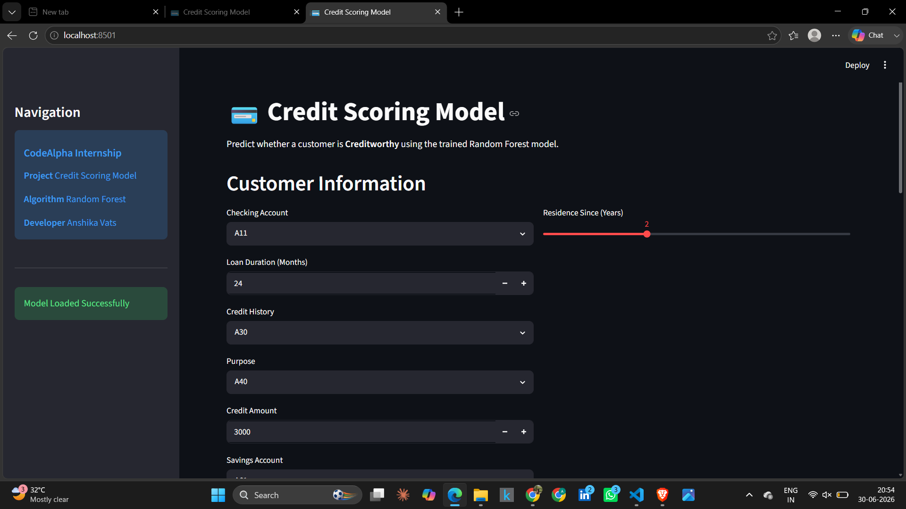
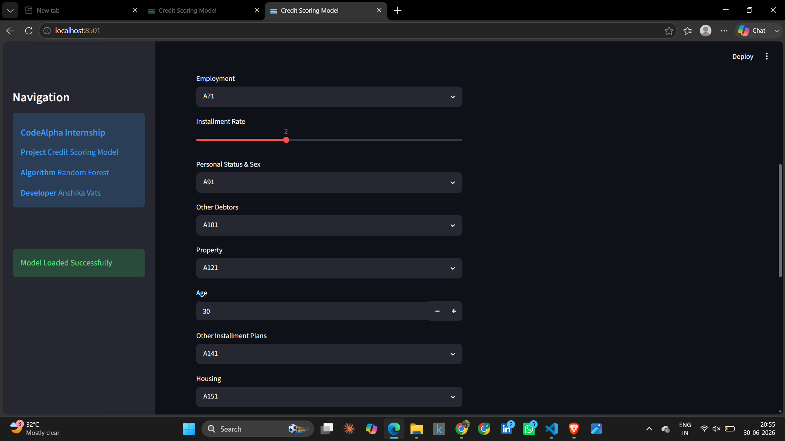
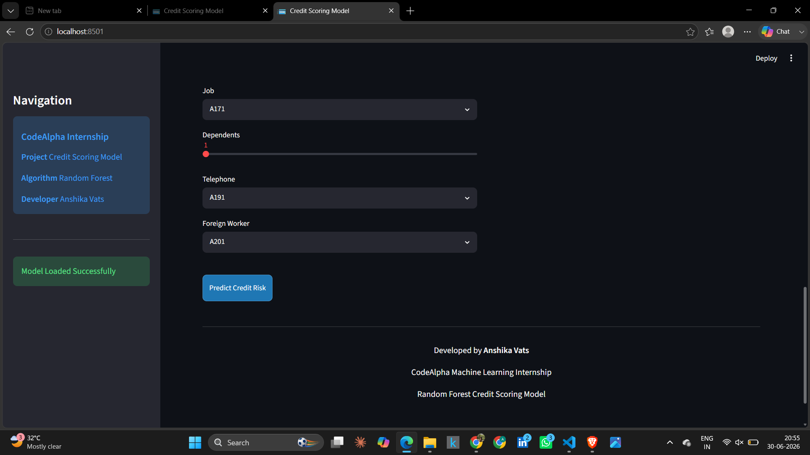
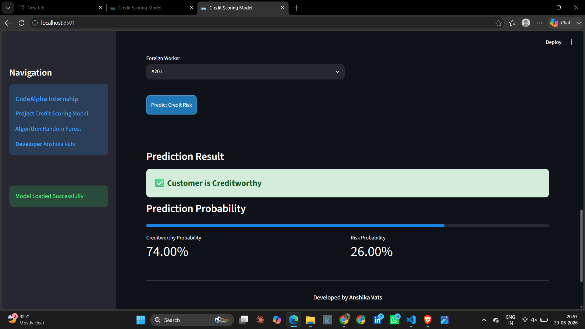
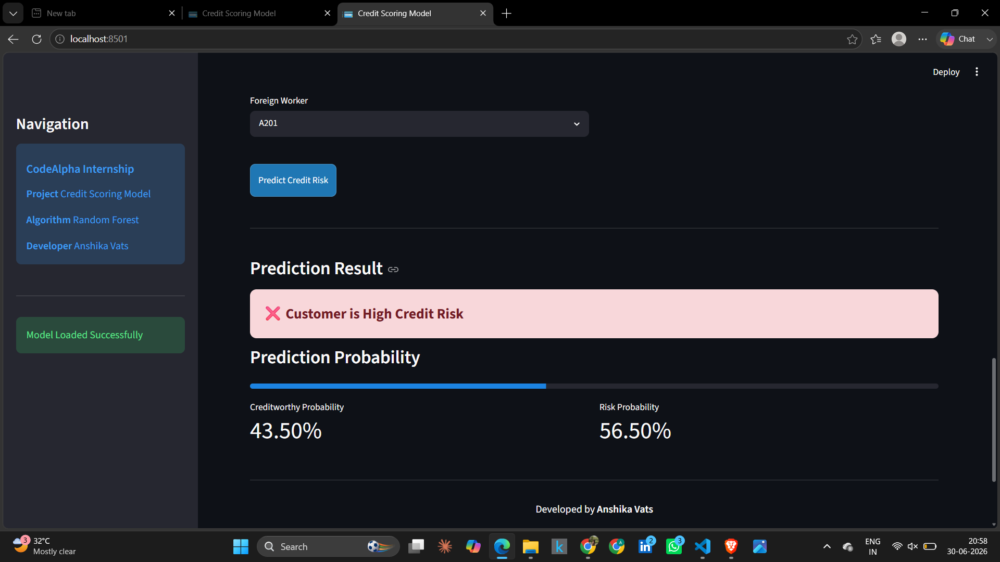

# 💳 Credit Scoring Model

<p align="center">
  
  
  
  
  
</p>

## 📌 Project Overview

This project was developed as part of the **CodeAlpha Machine Learning Internship**.

The objective is to build a Machine Learning model capable of predicting whether a customer is **creditworthy** based on their financial and personal information. Multiple classification algorithms were trained and evaluated, with **Random Forest** selected as the final model due to its superior performance.

The project also includes a **Streamlit web application** that allows users to enter customer information and receive real-time credit risk predictions.

---
## 🎥 Live Application

🌐 **Streamlit App**

https://codealphacreditscoringmodel-d4qwv9hvs2uctrqs98kk24.streamlit.app/
---
## 🎯 Objectives

- Perform data preprocessing on the German Credit Dataset.
- Train and compare multiple Machine Learning classification models.
- Evaluate models using standard classification metrics.
- Select the best-performing model.
- Deploy the model using Streamlit.
- Build an interactive user interface for real-time predictions.

---

## 📂 Dataset

**Dataset:** German Credit Dataset

- Source: UCI Machine Learning Repository
- Total Records: **1000**
- Features: **20**
- Target Variable:
  - **1 → Creditworthy**
  - **0 → High Credit Risk**

---

## ⚙️ Technologies Used

- Python
- Streamlit
- Pandas
- NumPy
- Scikit-learn
- Joblib
- Jupyter Notebook
- Git & GitHub

---

## 🤖 Machine Learning Models

The following models were trained and evaluated:

- Logistic Regression
- Decision Tree Classifier
- Random Forest Classifier ✅ (Best Model)

---

## 📊 Model Performance

| Model | Accuracy | Precision | Recall | F1 Score | ROC-AUC |
|--------|---------:|----------:|--------:|---------:|--------:|
| Logistic Regression | 74.0% | 80.14% | 83.57% | 81.82% | 78.23% |
| Decision Tree | 72.5% | 86.96% | 71.43% | 78.43% | 75.68% |
| **Random Forest** | **78.5%** | **80.89%** | **90.71%** | **85.52%** | **81.80%** |

---

## 🚀 Streamlit Application Features

- Interactive user interface
- Real-time credit prediction
- Prediction probability
- Professional dashboard
- Automatic categorical feature encoding
- Error handling
- Responsive layout

---

## 📁 Project Structure

```text
CodeAlpha_CreditScoringModel/

│── app.py
│── Credit_Scoring_Model_CodeAlpha.ipynb
│── README.md
│── requirements.txt
│── .gitignore

├── dataset/
│     └── german.data

├── models/
│     ├── best_model.pkl
│     └── scaler.pkl

└── images/
      ├── home_1.png
      ├── home_2.png
      ├── home_3.png
      ├── creditworthy_prediction.png
      └── high_risk_prediction.png
```

---
## 🖥️ Application Screenshots

### Home Page

The application interface is shown below.

#### Home Screen (Part 1)



#### Home Screen (Part 2)



#### Home Screen (Part 3)



---

### Prediction Results

#### Creditworthy Customer



#### High Credit Risk Customer



## ▶️ Installation

Clone the repository

```bash
git clone https://github.com/vatsanshika923-prog/CodeAlpha_CreditScoringModel.git
```

Move to the project directory

```bash
cd CodeAlpha_CreditScoringModel
```

Install dependencies

```bash
pip install -r requirements.txt
```

Run the application

```bash
streamlit run app.py
```

---

 ## 🌐 Live Demo

The application is deployed using **Streamlit Community Cloud**.

🔗 **Live Application**

https://codealphacreditscoringmodel-d4qwv9hvs2uctrqs98kk24.streamlit.app/

---
## 📌 Key Features

- Interactive Streamlit Dashboard
- Real-time Credit Risk Prediction
- Random Forest Classification Model
- Automatic Feature Encoding
- Prediction Probability Display
- Clean and User-Friendly Interface
- Model Persistence using Joblib
- Responsive Layout
---

## 📈 Future Improvements

- Hyperparameter tuning using GridSearchCV
- Feature engineering
- SHAP explainability
- XGBoost and LightGBM implementation
- Better UI/UX enhancements
- REST API integration
- Docker deployment

---
## 👩‍💻 Author

**Anshika Vats**

B.Tech – Computer Science & Engineering (Artificial Intelligence & Machine Learning)

Ajay Kumar Garg Engineering College (AKGEC)

GitHub: https://github.com/vatsanshika923-prog

LinkedIn: https://www.linkedin.com/in/anshika-vats

---

## ⭐ Acknowledgements

- CodeAlpha Machine Learning Internship
- UCI Machine Learning Repository
- Scikit-learn Documentation
- Streamlit Documentation

---

## 📜 License

This project is developed for educational and learning purposes as part of the CodeAlpha Machine Learning Internship.
